================================
Deploying and Running Robot Code
================================
**Turning on the robot**

To do anything with the robot, it must be on first. First put a battery into the robot:

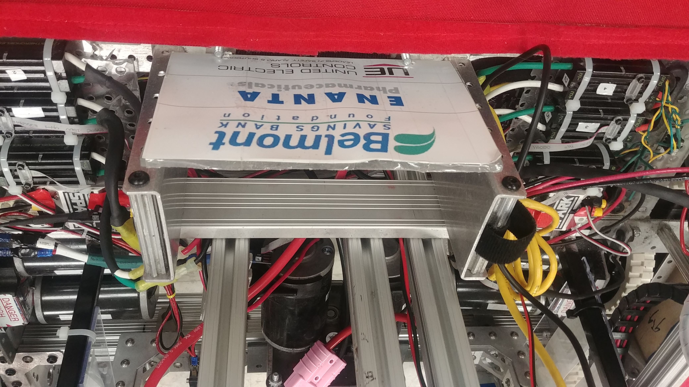

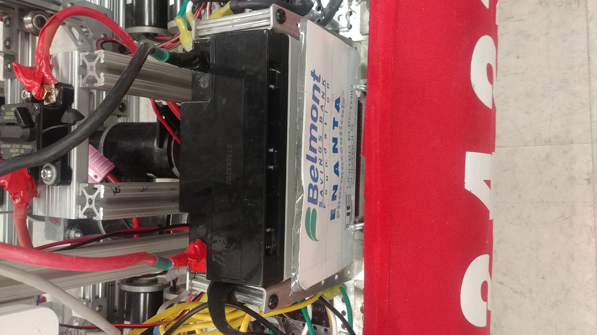

Make sure to secure it tightly with the velcro strap or you'll be sorry!!

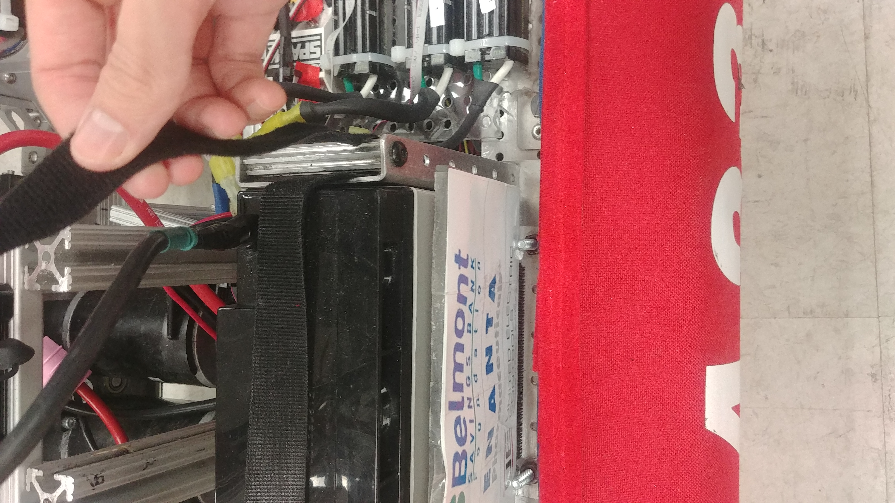

Next, plug in the battery by connecting the two pink ends together:

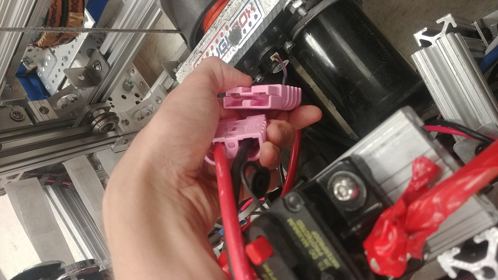

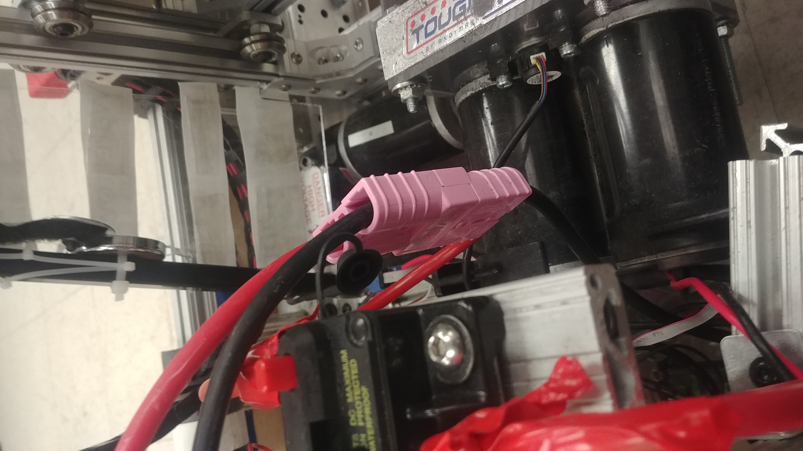

The battery is now connected and secured to the robot. Turn on the robot by pushing the black switch on the circuit breaker:

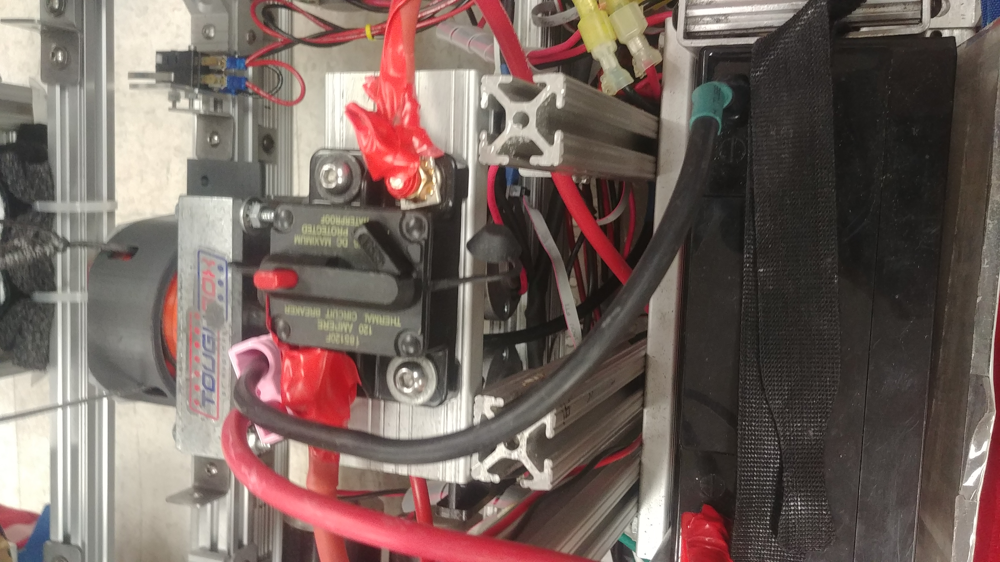

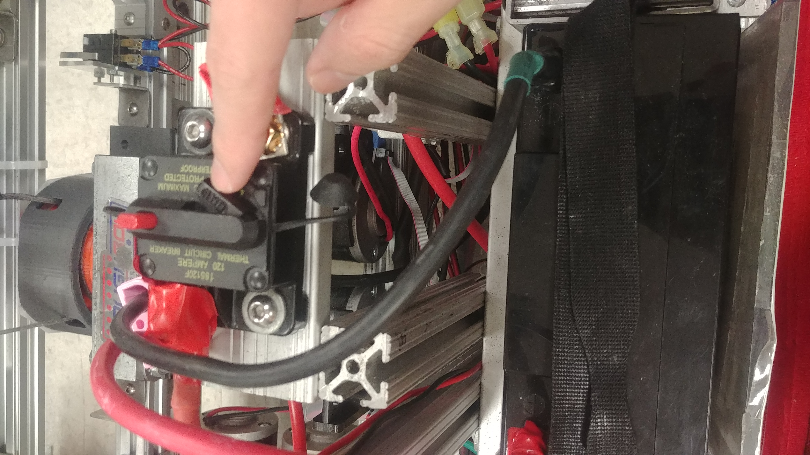

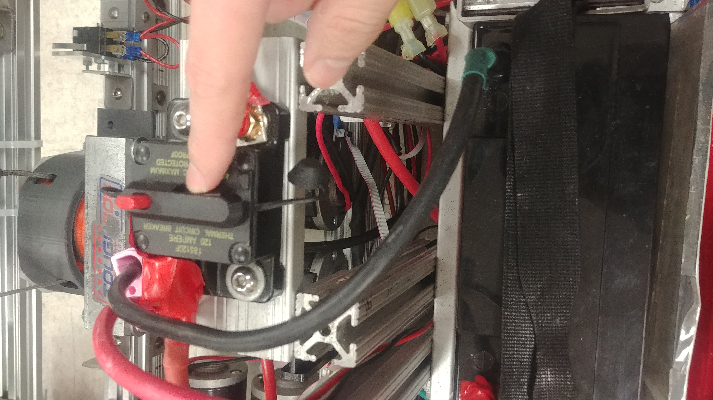

Pressing the red switch down opens the circuit and turns off the robot. Make sure to turn the robot off first before you unplug the battery!

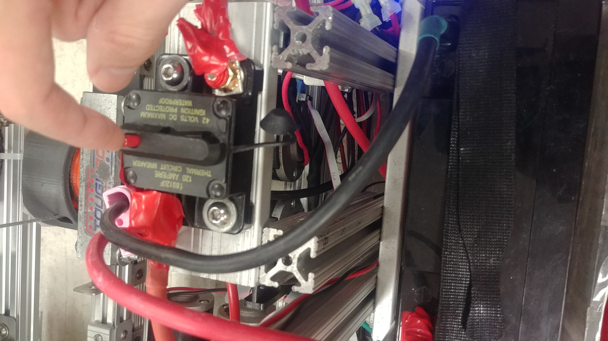

When the robot is off or the radio is unplugged, the radio should look like this:

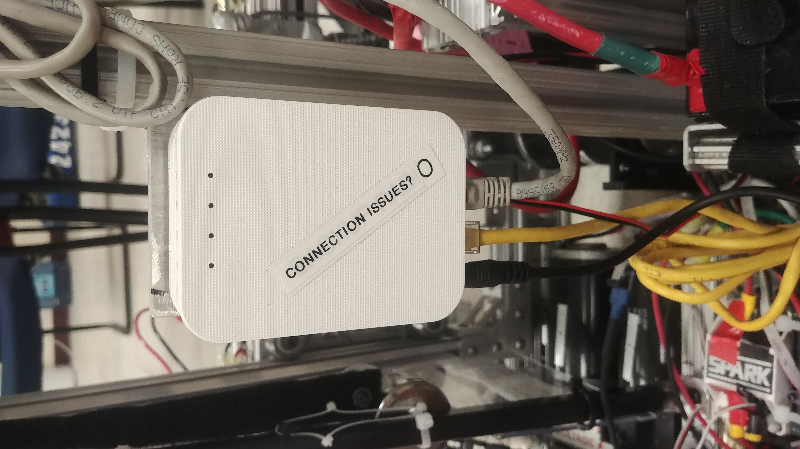

It takes the radio a minute to fully boot up. When it's fully booted and broadcasting the robot wireless network, the radio should look something like this:

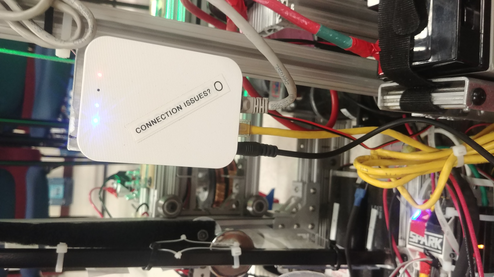

**Connect to the robot**

You must be first connected to the robot. Our wireless network should be 2423. The IP address of the router is 10.24.23.1 and the IP address of the robot is 10.24.23.2 or roborio-2423-frc.local. If you are having trouble deploying code troubleshoot by pinging these addresses:

.. code-block:: sh

   $ ping roborio-2423-frc.local
   $ ping 10.24.23.2
   $ ping 10.24.23.1

**Run the deploy command in the terminal**

Go to the terminal in the directory where you have your robot.py file. Type the following command (Note: if the command line doesn't like python try py or python3):

.. code-block:: sh

   $ python robot.py deploy --robot=[IP address of robot]

The IP address should be either *10.24.23.2* or *roborio-2423-frc.local*. If you don't have a robot available you can run this command to simulate the robot code:

.. code-block:: sh

   $ python robot.py sim
