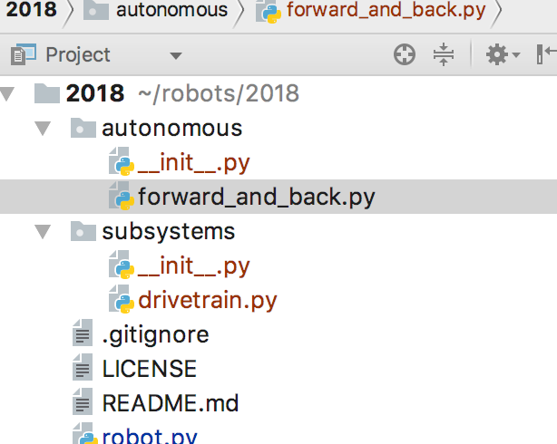

============================
Programming Autonomous Modes
============================
Notice how in our robot.py file there is no autonomous code? That’s because all autonomous related code goes inside the *autonomous* package next to the robot.py file. Each autonomous mode has its own file. MagicBot does the work of finding the autonomous modes, so we don’t have to write any code in our *robot.py* file.

Here's an example of an autonomous mode that moves forward for 2 seconds, turns 180 degrees, moves forward again for 2 seconds, then stops:

.. code-block:: python

  import wpilib
  from magicbot import AutonomousStateMachine, tunable, timed_state, state
  from components.drive_train import Drivetrain

  class Forward_And_Back(AutonomousStateMachine):
      MODE_NAME = 'Forward and Back'
      DEFAULT = True

      drivetrain = Drivetrain

      @timed_state(duration=2, next_state='turn', first=True)
      def forward(self):
          '''This happens first'''
          self.driveTrain.forward()

      @state()
      def turn(self):
          '''This happens second'''
          self.drivetrain.turn()

          if self.drivetrain.getAngle() > 180:
              self.next_state('back')
              
      @timed_state(duration=2, next_state='stop')
      def forward(self):
          '''This happens third'''
          self.drivetrain.forward()
          
      @state()
      def stop(self):
        '''This happens last'''
        self.drivetrain.stop()

