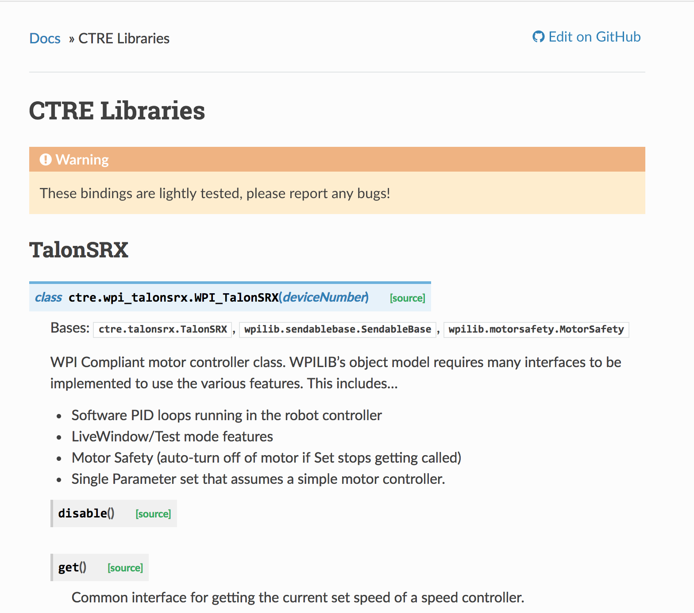
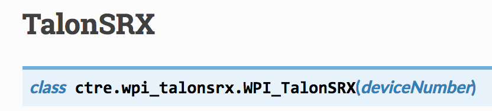
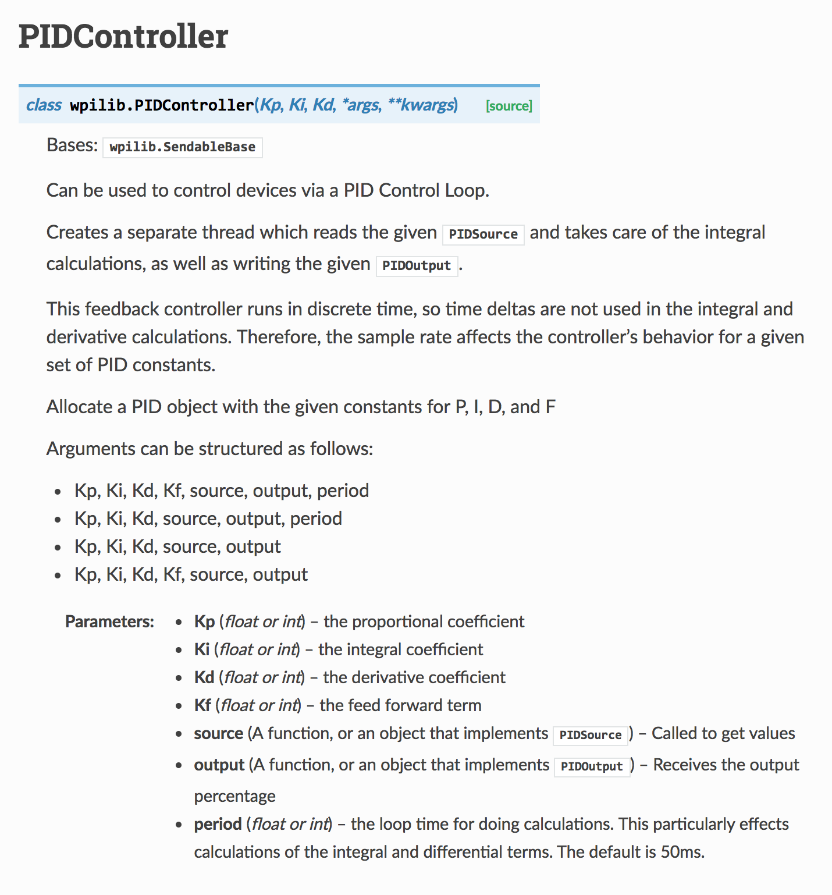
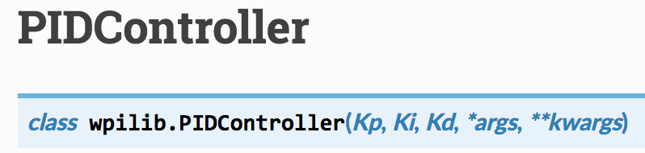
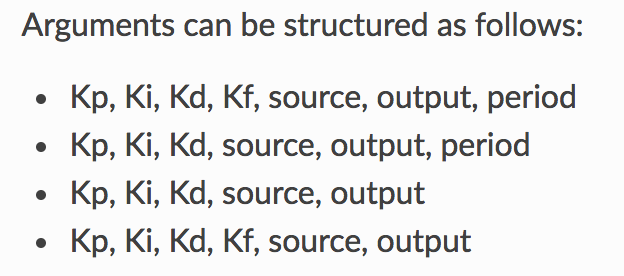
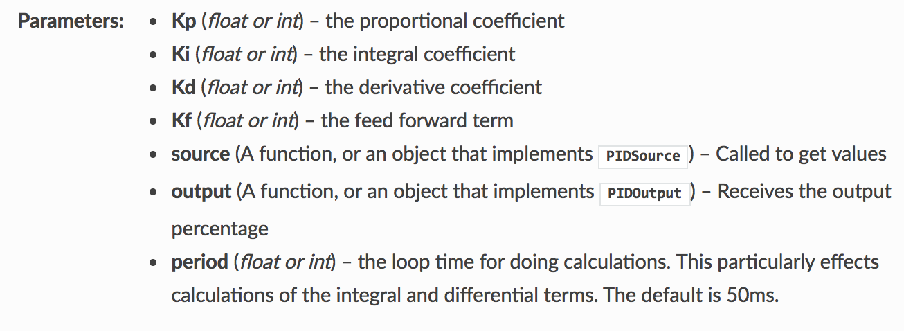

=====================================
How do you program robot components?
=====================================
To program motors, sensors, joysticks and other components, you must first create an object. To create an object you need:

- The class of the object
- The package the class is in
- The parameters needed to create the object
- to assign the object to a variable inside the createObjects function in robot.py

.. code-block:: python

   import magicbot
   import package
   
   class MyRobot(magicbot.MagicRobot):
     
     def createObjects(self):
       # This creates an object of type Class and assigns it to self.object
       self.object = package.Class(param1, param2, ...)

For example, to create a motor you need to use the wpi_talonsrx.WPI_TalonSRX class in the ctre library:

.. code-block:: python

   import magicbot
   import ctre
   
   class MyRobot(magicbot.MagicRobot):
     
     def createObjects(self):
       # The TalonSRX class requires a device number. The device # of this motor is 0
      self.motor = ctre.wpi_talonsrx.WPI_talonSRX(0)
      
  
Information on component classes can be found in the documentation:

- `wpilib package <http://robotpy.readthedocs.io/projects/wpilib/en/latest/wpilib.html>`_ (most of the classes you need are found here) 
- `wpilib.drive package <http://robotpy.readthedocs.io/projects/wpilib/en/latest/wpilib.drive.html>`_ (Tank drive, arcade drive, mecanum drive, etc)
- `ctre package <http://robotpy.readthedocs.io/projects/ctre/en/latest/api.html>`_ (Contains the TalonSRX class we need to program motors)

Here is the documentation for the TalonSRX class: http://robotpy.readthedocs.io/projects/ctre/en/latest/api.html#module-ctre.wpi_talonsrx

Notice the class name here:

In addition to telling you the class name, it also tells you the parameters it needs. In this case it only needs a device number. Some classes however have different options for parameters and addtional details if it isn't obvious what the parameters are for. The PIDController class is one example: http://robotpy.readthedocs.io/projects/wpilib/en/latest/wpilib/PIDController.html

Notice how the end of the parameter list in the class says *args, **kwargs*?

This basically means that there are different options for what you can put after the first 3 parameters *Kp, Ki and Kd*

A description for each parameters can be found below that:

