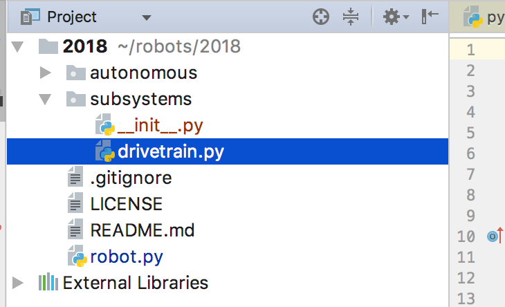

=======================
Programming Subsystems
=======================
The subsystems are the main parts of the robot. They include the drivetrain and arm effectors (game piece intakes, elevators, climbers, etc). Each subsystem needs its own class. For example, we would probably create a Drivetrain class for the drivetrain subsystem.

We'll create a *subsystem* folder next to the robot.py file and create a file for each subsystem inside that folder.

Here is some possible code for the *drivetrain* subsystem:

.. code-block:: python

  import wpilib

  class Drivetrain:

      # We include the drive variable we defined inside of the createObjects function in robot.py.
      # It must have the same name and it must be equal to the class that was used to create it.
      drive = wpilib.drive.DifferentialDrive

      def setup(self):
          '''Initialize stuff here. We want to be stopped initially.'''
          self.stop()

      def stop(self):
          self.turn_rate = 0
          self.speed = 0

      def forward(self):
          self.turn_rate = 0
          self.speed = 0.5

      def backward(self):
          self.turn_rate = 0
          self.speed = -0.5

      def arcade(self, speed, turn_rate):
          self.speed = speed
          self.turn_rate = turn_rate

      def execute(self):
          '''This is called automatically each iteration of the control loop'''
          self.drive.arcadeDrive(self.speed, self.turn_rate)

And here is how you include it inside your *robot.py* file:

.. code-block:: python

  import magicbot
  import wpilib
  import ctre
  
  # We import the subsystem classes
  from subsystems.drivetrain import Drivetrain 

  class MyRobot(magicbot.MagicRobot):

      # We initialize the subsystem by setting a variable equal to the class. 
      drivetrain = Drivetrain

      def createObjects(self):
          '''We create our components here. Anything created here can be included inside our subsystems.'''
          self.left_motor = ctre.wpi_talonsrx.WPI_TalonSRX(0)
          self.right_motor = ctre.wpi_talonsrx.WPI_TalonSRX(1)
          self.drive = wpilib.drive.DifferentialDrive(self.left_motor, self.right_motor)

          self.joystick = wpilib.Joystick(0)

      def teleopPeriodic(self):
          '''Called on each iteration of the control loop'''
          self.drivetrain.arcade(self.joystick.getY(), self.joystick.getX())

  if __name__ == '__main__':
      wpilib.run(MyRobot)

