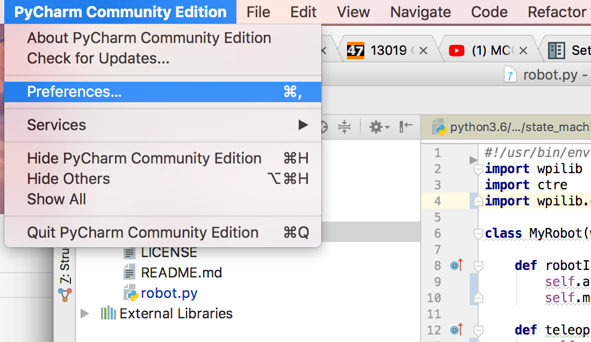
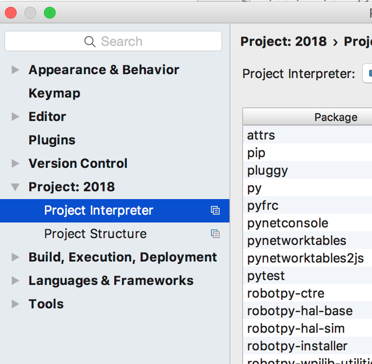
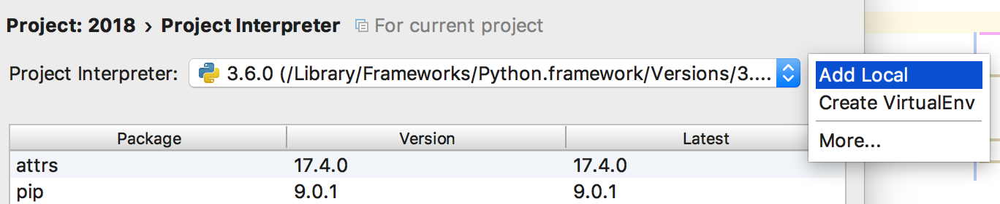

=============================
Setting Up Python and PyCharm
=============================
We'll be using the python language and the PyCharm editor/IDE to write our robot code.

Download Python
===============
If you don't have it already, download python 3.6 here: https://www.python.org/downloads/

Downloading and setting up PyCharm
==================================
Download the free community edition of PyCharm here: https://www.jetbrains.com/pycharm/download

When PyCharm is downloaded and installed, you need to configure it to use the version of python you installed. *Go to PyCharm Community Edtion > Preferences...* and go to *Project: [project name]* > Project Interpreter:

Then click the button to the right of the dropdown and click add local:

Locate python 3.6 and add it.
