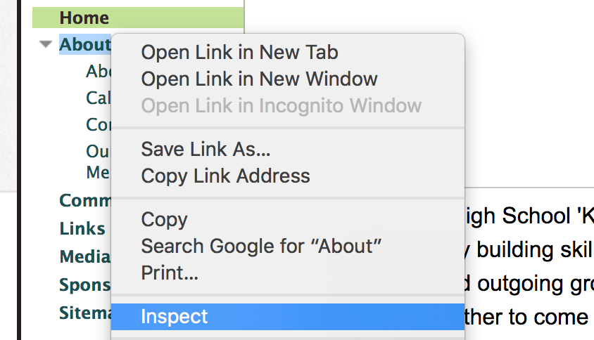
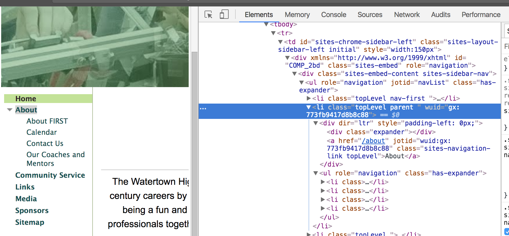
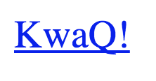
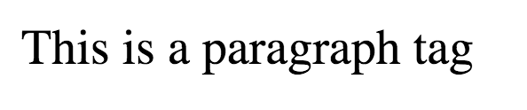
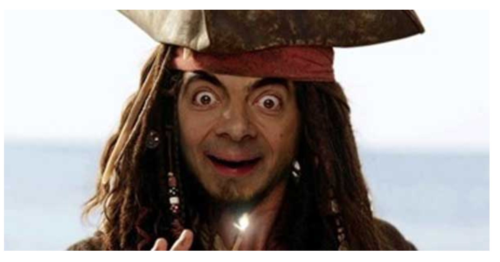
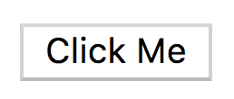
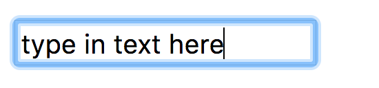
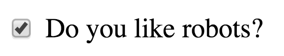
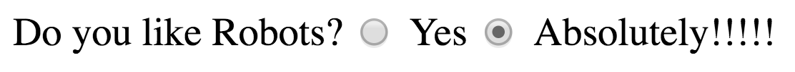
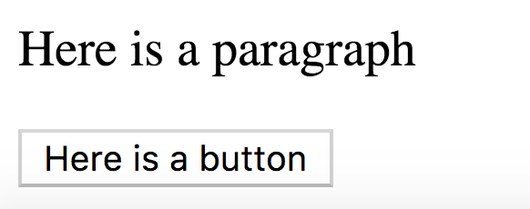

====================
What is HTML
====================

Lets start by understanding how HTML works. HTML is the code that defines the content and structure of a web page. HTML is made up of elements (or tags) that make up the web page's components. HTML elements can contain content and other HTML elements.

For example, a web page's navigation menu is itself an HTML element that contains an HTML element for each of its menu items. For example, the HTML for the about menu on the www.team2423.org website might look something like this:

.. code-block:: html

   <nav>
     About
     

       <a href="/about/about-first">About FIRST</a>
       <a href="/about/calendar">Calendar</a>
       <a href="/about/contact-us">Contact Us</a>
       <a href="/about/our-coaches-and-mentors">Our Coaches and Mentors</a>
     

   </nav>

You can see the real HTML by right clicking the element to open the context menu and clicking inspect:

The actual HTML looks a lot more complex, but basic idea is the same.

How do you create an HTML element?
===================================

An html element has an opening and closing tag. The opening tag looks like this:

 .. code-block:: html
  <element>

And the closing tag looks like this:

 .. code-block:: html
  </element>

Notice how the name of the tag (element) is the same for both? The only difference is that the closing tag has a **/** after the **<**. Together the opening and closing tag forms an HTML element:

 .. code-block:: html
  <element></element>

HTML inside other HTML elements looks like this:

 .. code-block:: html
  <element>
    <element>Child 1</element>
    <element>Child 2</element>
    <element>Child 3
      <element>Grandchild 1</element>
      <element>Grandchild 2</element>
    </element>
  </element>

Elements that contain other elements are called **parents**, and the elements inside of them are called its **children**.

What does a full web page look like?
=====================================

This is really all that's needed to build a very basic web page:

 .. code-block:: html

  <html>
    <head>
      <title>Tutorial</title>
    </head>
    <body>
      Content goes here
    </body>
  </html>

The **html** element is the root of the entire page. Everything else is a child of this element. The **head** element contains metadata about the page. The **title** element is used to set the label you see in the browser window/tab.

The browser's visible content goes inside the **body** element. Everything from the logo and navigation menu at the top to the footer at the bottom is contained inside this element.

Element attributes
=====================

How an element looks and behaves is determined by its attributes as well as its content. An attribute has two parts, its name and its value. The name of the attribute is followed by an equal sign and a value surrounded by quotes. For example:

.. code-block:: html

  <a href="http://google.com">google!</a>

This is a link element with the text *google!* that goes to the google homepage when you click on it. The address of the link is determined by the href attribute. href is the attribute name and the address is inside the quotes.

Web page elements
=====================================

Here are some elements that we'll be frequently using:

**anchor (link)**

.. code-block:: html

  <a href="www.team2423.org">KwaQ!</a>

**paragraph**

.. code-block:: html

  
This is a paragraph tag

A paragraph tag is a great way to display text. Each paragraph starts on a new line.

**image**

.. code-block:: html

  

This is used to display an image. The src attribute requires the address of the image. An image tag does not contain any content, so it does not have a closing tag. Notice how the opening tag ends with a */>*?

**button**

.. code-block:: html

  <button>Click Me</button>

**text input**

.. code-block:: html

  <input type="text" value="type in text here"/>

This is a text input field. Text inputs, checkboxes, and radio buttons all share the same tag (input) and use the type attribute to set what kind of input it is. Just like the  element an input is self closing. The value of a text input determines what text is inside the input field. Typing in different text automatically changes its value.

**checkbox**

.. code-block:: html

  <input type="checkbox" checked="checked" /> Do you like robots?

To select the checkbox by default add *checked="checked"*.

**radio button**

.. code-block:: html

  Do you like Robots?
  <input type="radio" name="robots" value="yes" /> Yes
  <input type="radio" name="robots" checked="checked" value="absolutely" /> Absolutely!!!!!

Radio buttons are like checkboxes, except that they come in groups and only one radio button from the group can be selected. In order to group radio buttons together they have to share a *name*. Notice how the radio inputs all have a name attribute and their values are all the same.

**div**

.. code-block:: html

  

    
Here is a paragraph

    <button>Here is a button</button>
  

Divs are used as containers for other elements. You can use them to create sections or components for your web page.

