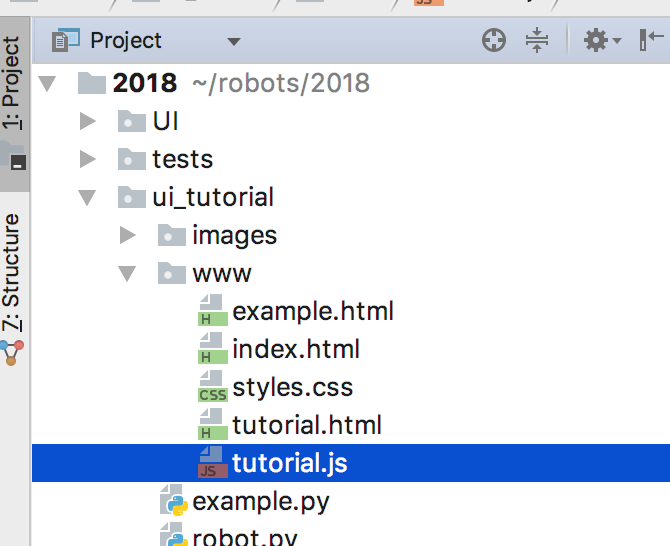

======================
Javascript and jQuery
======================

In order to make the web page interactive we'll need to write some javascript. A lot of the code we write will be to update, read, and listen to events from the elements of our page. We do these things with a javascript library called jQuery.

Create the javascript file
===========================

Just like our css file, we'll create a js file and include it in our page. Call it *tutorial.js* and put it in the same folder as your html and css files.

To include the script in your page create a *script* tag and add it before the end of the body in your html page. The script tag will have a *src* attribute which tells it the location of the file:

.. code-block:: html

  
  

jQuery
===========================

jQuery is similar to css in that it needs a selector to find the elements we want to look at, change, or listen to. This is how you select elements in jQuery:

.. code-block:: javascript

  $('selector goes here...')
  
Let's start by downloading jQuery. Go to https://jquery.com/download/ and click *Download the compressed, production jQuery 3.2.1*:

Place the jQuery file in the */www/* folder next to your html, js, and css files and include it in your html file. Make sure to place the include **before** the tutorial.js include, as tutorial.js will depend on jQuery so jQuery needs to run first in order for tutorial.js to work properly.

So if we wanted to select all buttons on the page we'd do this:

.. code-block:: javascript

  $('button')
  
Let's enter this code into the console in chrome! To do this Press Ctrl + Shift + J (Windows / Linux) or Cmd + Opt + J (Mac):

When you enter the code above into the console, it should output a message that starts like this: *r.fn.init(4)*. Expand this message and you should see four buttons. Hovering over each will highlight the button in the actual web page:

So how do we know if our selector worked? We can check how many elements jQuery found with the *length* property:

.. code-block:: javascript

  $('button').length

Enter this into the console. It should output *4*. Now that we've selected our buttons let's do something with them. Let's start by geting the text inside of the buttons:

.. code-block:: javascript

  var text = $('button').text();

Now the text is stored inside of the *text* variable. If you enter this into the console it will conbine the text of all the elements you've selected. To get the text of just one button you have to select only one of the buttons. Now let's set the text of the buttons: 

.. code-block:: javascript

  $('button').text('Some text here...');
  
Now the text of the buttons should all be the same! Let's add some code to our tutorial.js file. We're going to double the text inslude of a button whenever it is clicked. Add this code to the js file:

.. code-block:: javascript

  $('button').on('click', function() {
    var text = $(this).text();
    $(this).text(text + text);
  });

In the above code we use the *on* function to handle an event on our selected elements. The first parameter the on function needs is the type of event, which is *click* in this case. THe second parameter needed is a function to run code when the event is triggered.

Also notice how we use *$(this).text()* inside the function instead of *$('button').text()* like we did before. That's because inside event handlers *$(this)* gives you the element that triggered the event. *$('button')* would select all buttons on the page, but we really just want to select the button that triggered the event in this case.

Save the file and refresh the page. Now each button's text will double every time you click on it.

