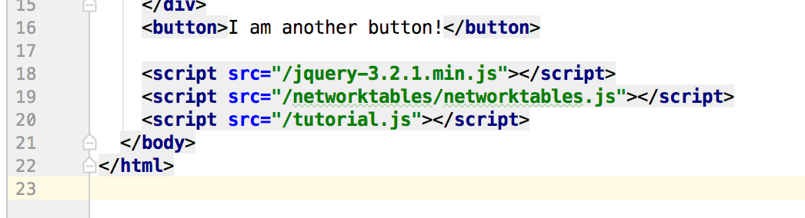

======================
Networktables
======================

**NetworkTables resource**

`<http://robotpy.readthedocs.io/projects/pynetworktables/en/latest/api.html>`_
`<http://robotpy.readthedocs.io/projects/pynetworktables2js/en/stable/>`_

**Install NetworkTables**

Type these commands in the terminal:

.. code-block:: sh

   $ pip3 install pynetworktables
   $ pip3 install pynetworktables2js

**What is NetworkTables?**

Networktables allows communication between our robot, web interface, and other devices. 

**NetworkTables on the robot**

To use NetworkTables on the robot we must import it just like we do with wpilib:

.. code-block:: Python

   from networktables import NetworkTables
   
Next we have to create a table. We put things in the table if we want to send things to other devices, and we get things from the table that are sent from other devices:

.. code-block:: Python

   table = NetworkTables.getTable("robot")
   
To get something from the table we'd say

.. code-block:: Python

   number_variable = table.getNumber('some_number')
   boolean_variable = table.getBoolean('some_boolean')
   string_variable = table.getString('some_string')

If we want to put something in the table we'd say:

.. code-block:: Python

    table.putNumber('some_number', 10)
    table.putBoolean('some_boolean', True)
    table.putString('some_string', 'Some string')

**NetworkTables on a webpage**

Add this script tag to your html page before the tutorial.js include:

.. code-block:: html

   

Getting and putting values in the NetworkTables is a bit different in Javascript. You do not create a table but type in:

.. code-block:: Javascript

   NetworkTables.putValue('/table name/key', value);
   NetworkTables.getValue('/table name/key', default_value);
   
To listen to changes in the table:

.. code-block:: Javascript
   NetworkTables.addGlobalListener(function(key, value, isNew){
       // do something with the values as they change
   }, true);

   NetworkTables.addKeyListener(key, function(value, isNew){
       // do something with the values as they change
   }, true);
